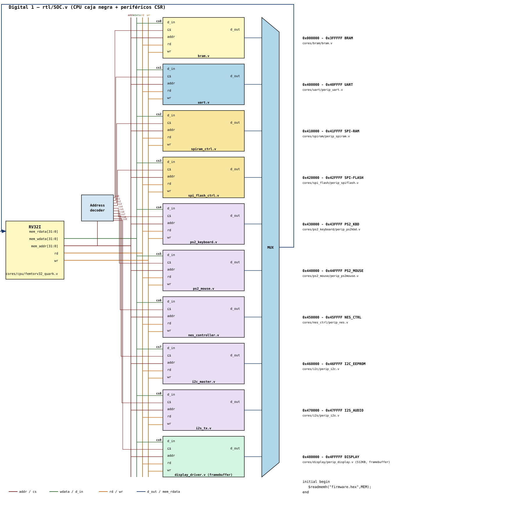

# Proyecto Digital 1 — Consola de videojuegos retro sobre FPGA

> **Versión preliminar (checkpoint 1).** Este documento presenta **qué vamos a construir** y **cómo nos dividimos el trabajo**. Las especificaciones de registros, los diagramas y las fechas son propuestas que se irán refinando en cada checkpoint.
>
> Guía del curso: [cicamargoba/digital_UN — 2026_1](https://github.com/cicamargoba/digital_UN/tree/main/2026_1) · Rúbrica: [`rubrica_evaluacion_proyecto.md`](https://github.com/cicamargoba/digital_UN/blob/main/rubrica_evaluacion_proyecto.md)

## 1. Qué vamos a hacer

Una **consola de videojuegos retro** en una FPGA. Tiene tres partes:

- Un procesador **RISC-V (femtorv32, RV32I)** que ejecuta el juego escrito en **C**. El procesador se usa como **caja negra**: no lo diseñamos ni lo modificamos.
- Un **panel de LEDs** como pantalla, manejado por un framebuffer.
- **Periféricos** diseñados por nosotros en **Verilog**: teclado y mouse PS/2, control NES, memorias SPI, EEPROM I2C para los puntajes, audio I2S y UART para depuración.

El procesador se comunica con cada periférico mediante **registros mapeados en memoria (CSR)**: el firmware escribe o lee una dirección y el hardware responde.

Todo el curso construye **una sola consola compartida**. Cada equipo es dueño de un periférico (o de dos relacionados) y al final todos se integran sobre el mismo bus. Si un módulo falla, falla en la demo de todo el curso.

### Lo que diseñamos y lo que recibimos

| Lo diseñamos nosotros | Se entrega como andamiaje (no se diseña) |
|---|---|
| Periféricos RTL: UART, SPI-RAM, SPI-Flash, PS/2 teclado, PS/2 mouse, NES, I2C, I2S | Procesador femtorv32 (caja negra) |
| Drivers en C de cada periférico | Núcleo del juego (FSM, sprites, colisión) |
| Decodificador de direcciones, mux de lectura e integración del SoC | Driver del panel / framebuffer |
| Programas C de prueba e integración | BRAM de arranque |

## 2. Metodología

Seguimos el flujo **top-down** del curso: **flowchart → ASM → RTL → hardware**. Cada periférico pasa por los mismos checkpoints:

| # | Checkpoint | Entregable por periférico |
|---|---|---|
| 1 | Flowchart + especificación CSR | `cores/<p>/README.md` y `cores/<p>/diagramas/` |
| 2 | ASM | Diagrama ASM del datapath y del control |
| 3 | RTL simulado | `rtl/*.v`, testbench automático, `make sim` en PASS, `.gtkw` |
| 4 | Integración en hardware | Periférico funcionando en la FPGA dentro del SoC compartido |
| 5 | Demo final | Consola completa jugando |

## 3. Arquitectura del sistema



El **decodificador de direcciones** genera `cs0`–`cs9` a partir de `mem_addr`. Todos los periféricos tienen el mismo contrato de puertos (`d_in`, `cs`, `addr`, `rd`, `wr`, `d_out`) y un **mux** lleva el `d_out` del periférico seleccionado a `mem_rdata`.

Más detalle: [`diagramas/`](diagramas/README.md) (bloques y flujo del sistema) e [`interfaces/`](interfaces/README.md) (contrato de puertos y convenciones CSR).

## 4. Mapa de memoria

| Rango | Periférico | Equipo | Carpeta |
|---|---|---|---|
| `0x000000 – 0x3FFFFF` | BRAM (arranque / firmware) | andamiaje · integra G1 | — |
| `0x400000 – 0x40FFFF` | UART (depuración) | G1 | [`cores/uart`](cores/uart/README.md) |
| `0x410000 – 0x41FFFF` | SPI-RAM | G2 | [`cores/spiram`](cores/spiram/README.md) |
| `0x420000 – 0x42FFFF` | SPI-Flash | G2 | [`cores/spi_flash`](cores/spi_flash/README.md) |
| `0x430000 – 0x43FFFF` | Teclado PS/2 | G3 | [`cores/ps2_keyboard`](cores/ps2_keyboard/README.md) |
| `0x440000 – 0x44FFFF` | Mouse PS/2 | G3 | [`cores/ps2_mouse`](cores/ps2_mouse/README.md) |
| `0x450000 – 0x45FFFF` | Control NES | G4 | [`cores/nes_ctrl`](cores/nes_ctrl/README.md) |
| `0x460000 – 0x46FFFF` | I2C (EEPROM / puntajes) | G5 | [`cores/i2c`](cores/i2c/README.md) |
| `0x470000 – 0x47FFFF` | I2S (audio) | G6 | [`cores/i2s`](cores/i2s/README.md) |
| `0x480000 – 0x4FFFFF` | Display (framebuffer, 512 KB) | andamiaje · integra G4 | — |
| `0x500000` | `blink` (ejemplo guía) | referencia | [`cores/blink`](cores/blink/README.md) |

Las mismas direcciones están en C en [`interfaces/memory_map.h`](interfaces/memory_map.h).

## 5. División del trabajo

Somos **6 grupos de 3 integrantes**. Cada grupo es dueño de uno o dos periféricos **y** de su driver en C. Cada integrante tiene tareas propias con su nombre en el cronograma.

| Grupo | Responsabilidad | Periféricos |
|---|---|---|
| **G1** | Integración del SoC, UART y firmware de integración | decodificador + mux, `uart`, BRAM |
| **G2** | Memoria externa SPI | `spiram`, `spi_flash` |
| **G3** | Entradas PS/2 | `ps2_keyboard`, `ps2_mouse` |
| **G4** | Control NES y pantalla | `nes_ctrl`, integración del display |
| **G5** | I2C y puntajes | `i2c` (EEPROM) |
| **G6** | Audio | `i2s` |

Detalle por integrante: [`planificacion/equipos.md`](planificacion/equipos.md).
Cronograma con fechas, dependencias y evidencias: [`planificacion/cronograma.md`](planificacion/cronograma.md).

## 6. Planificación y seguimiento

- Cada tarea se crea como **issue** con el formulario [`tarea.yml`](.github/ISSUE_TEMPLATE/tarea.yml). El formulario pide equipo, responsable, fechas, dependencias, criterios de aceptación y evidencia.
- Todos los issues se agregan al **GitHub Project** general, con una vista de tabla (seguimiento) y otra de roadmap (cronograma). La configuración está en [`planificacion/README.md`](planificacion/README.md).
- Una tarea se cierra solo cuando hay **evidencia verificable**: un PR, una simulación en PASS, formas de onda o un video en la FPGA.

### Repositorio general y repositorios de equipo

Este es el **repositorio general**. Contiene la arquitectura, las interfaces, el mapa de memoria, la plantilla y la integración.

1. Cada grupo crea **su propio repositorio** a partir de esta estructura y trabaja en `cores/<su periférico>/`.
2. Los cambios comunes (mapa de memoria, interfaces, plantilla) se hacen aquí y los grupos los traen a su repo.
3. Cuando un periférico pasa `make sim` y se prueba en la FPGA, el grupo abre un **pull request** hacia este repositorio con su carpeta `cores/<p>/`. El G1 lo revisa y lo integra.

## 7. Estructura del repositorio

```
.github/ISSUE_TEMPLATE/tarea.yml   formulario para crear tareas
planificacion/                     GitHub Projects, equipos y cronograma
diagramas/                         diagramas de bloques y de flujo del sistema
interfaces/                        contrato de puertos, convenciones CSR y memory_map.h
cores/                             un directorio por periférico
    <periferico>/
        README.md                  función, protocolo, registros CSR, plan de pruebas
        diagramas/                 bloques, flujo, estados / ASM
        rtl/                       Verilog, testbench, Makefile, .gtkw
        firmware/                  driver en C
    blink/                         ejemplo guía completo del profesor
firmware/                          juego y programas C de integración/prueba
diagrama_soc_digital1_v3.svg       diagrama de bloques del SoC
```

## 8. Cómo probar el ejemplo guía

Requisitos: [Icarus Verilog](https://bleyer.org/icarus/) y [GTKWave](https://gtkwave.sourceforge.net/) (en Windows vienen juntos en el instalador de Icarus) y `make`.

```bash
cd cores/blink/rtl
make sim      # compila y corre el testbench; debe imprimir PASS
make wave     # abre las formas de onda en GTKWave
```

## 9. Evaluación

El proyecto vale el **50 % de la nota final**. Se califica con la rúbrica del curso: especificación, arquitectura, implementación, integración HW-SW, verificación, funcionamiento, documentación y, **de forma individual**, planificación y contribución en GitHub. Por eso cada tarea debe tener un responsable con nombre y quedar enlazada a sus commits y a su PR.
