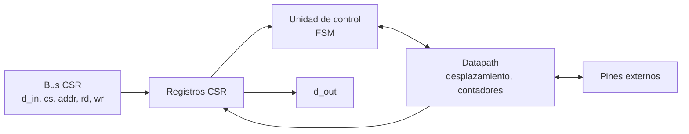
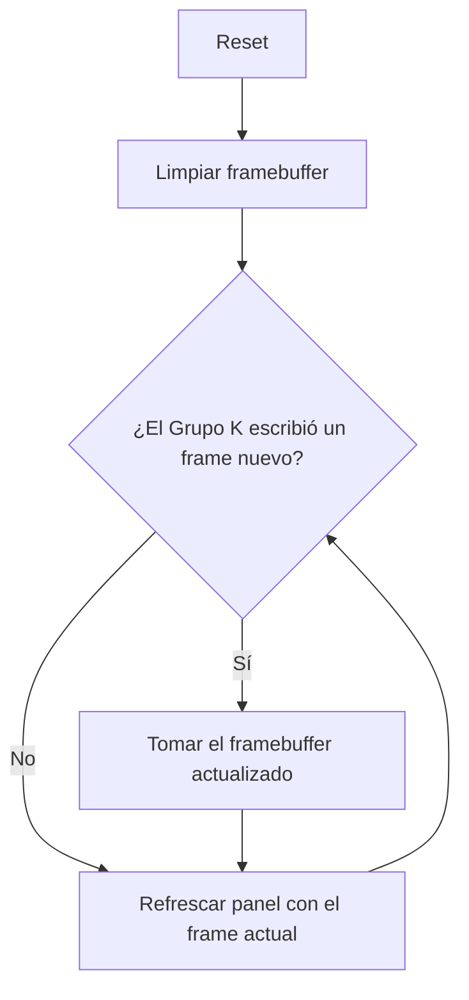

# Diagramas — Display (panel LED / framebuffer)

## Diagrama de bloques

## Diagrama de flujo

## Máquina de estados

Contador de filas y columnas que recorre el framebuffer y la máquina de envío al panel (según el tipo de panel).

El diagrama ASM detallado se agrega aquí en el checkpoint 2.
