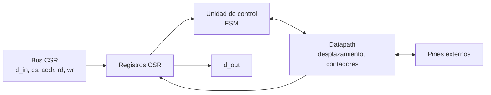
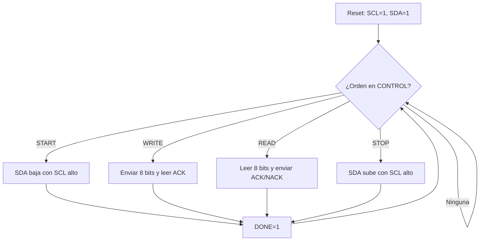

# Diagramas — I2C (EEPROM de puntajes)

## Diagrama de bloques

## Diagrama de flujo (preliminar)

## Máquina de estados

`IDLE`, `START`, `BIT` (contador 0–7), `ACK`, `STOP`, cada uno dividido en fases del reloj SCL. El firmware arma la secuencia completa de la EEPROM con estas órdenes básicas.

El diagrama ASM detallado se agrega aquí en el checkpoint 2.
