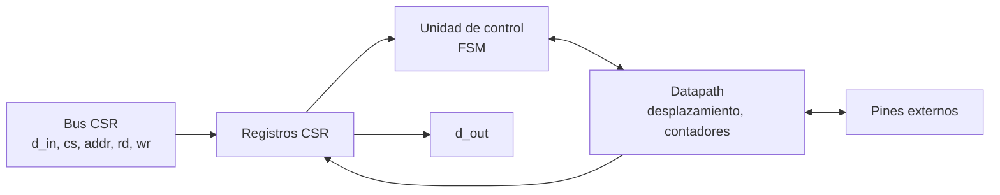
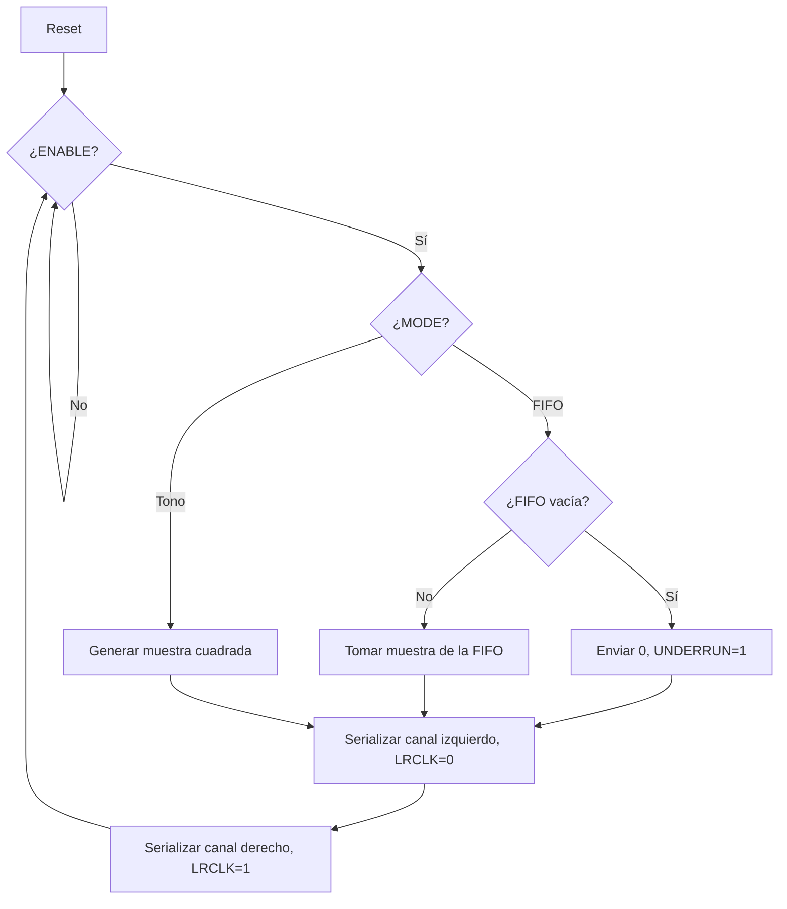

# Diagramas — I2S (audio)

## Diagrama de bloques

## Diagrama de flujo (preliminar)

## Máquina de estados

Contador de bits (0–31) que genera BCLK/LRCLK; registro de desplazamiento de 32 bits; FIFO de muestras; generador de tono opcional.

El diagrama ASM detallado se agrega aquí en el checkpoint 2.
