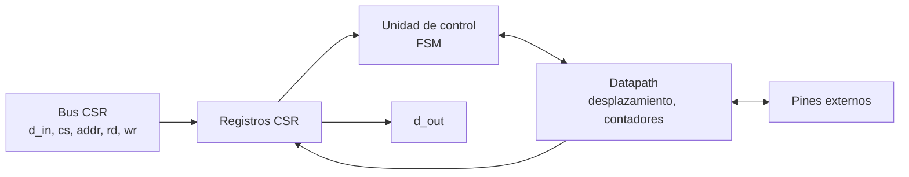
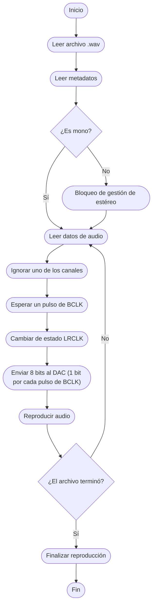

# Diagramas — I2S (audio)

## Diagrama de bloques

## Diagrama de flujo

> El diagrama de flujo corresponde a la hoja **«I2S»** de [`diagramas/Diagrama_de_Flujo.drawio`](../../../diagramas/Diagrama_de_Flujo.drawio).

## Máquina de estados

Contador de bits (0–7) que genera BCLK/LRCLK, registro de desplazamiento de 8 bits y FIFO de muestras.

El diagrama ASM detallado se agrega aquí en el checkpoint 2.
