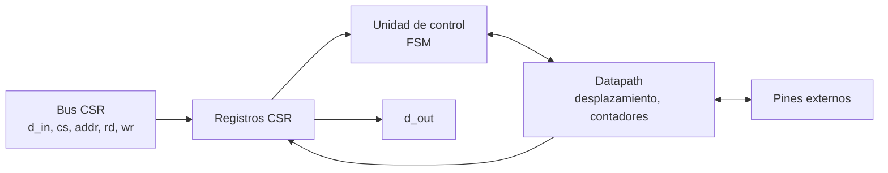
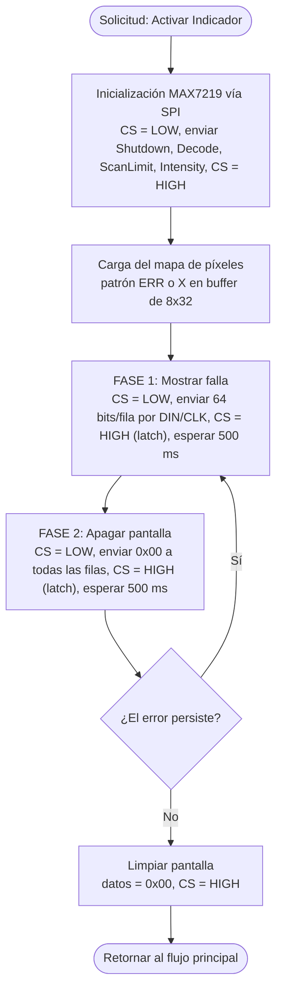

# Diagramas — Pantallas RGB e indicadores LED de puerto

## Diagrama de bloques

## Diagrama de flujo

> El diagrama de flujo corresponde a la hoja **«Matriz led»** de [`diagramas/Diagrama_de_Flujo.drawio`](../../../diagramas/Diagrama_de_Flujo.drawio).

## Máquina de estados

`INIT`, `LOAD`, `SHOW` (500 ms), `OFF` (500 ms), `CLEAR`. Datapath: maestro SPI de 16 bits, buffer de 8×32 y temporizador de 500 ms.

El diagrama ASM detallado se agrega aquí en el checkpoint 2.
