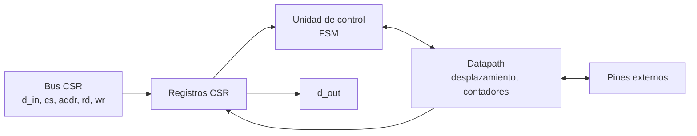
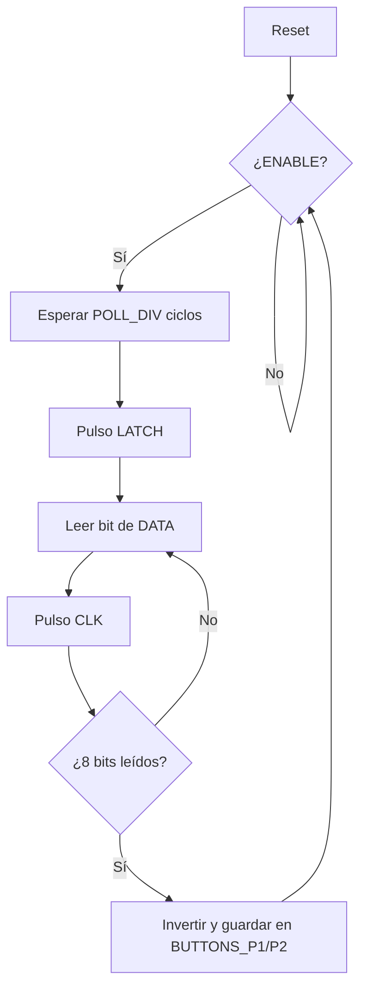

# Diagramas — Control NES

## Diagrama de bloques

## Diagrama de flujo (preliminar)

## Máquina de estados

`IDLE`, `LATCH`, `READ`, `SHIFT`, `DONE`. Datapath: divisor de tiempo, contador de bits (0–7), dos registros de desplazamiento.

El diagrama ASM detallado se agrega aquí en el checkpoint 2.
