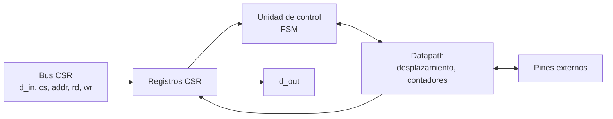
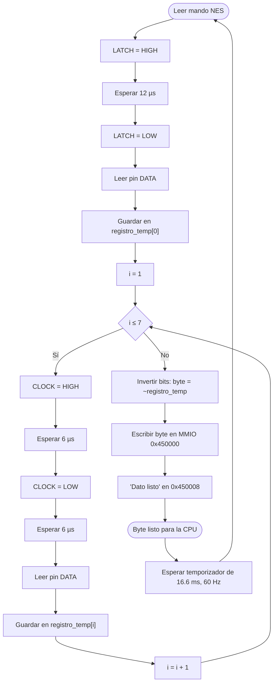

# Diagramas — Control NES

## Diagrama de bloques

## Diagrama de flujo

> El diagrama de flujo corresponde a la hoja **«Controlador NES»** de [`diagramas/Diagrama_de_Flujo.drawio`](../../../diagramas/Diagrama_de_Flujo.drawio).

## Máquina de estados

`IDLE`, `LATCH` (12 µs), `READ`, `CLK_HIGH` (6 µs), `CLK_LOW` (6 µs), `STORE`, `WAIT_60HZ`. Datapath: contador de tiempo, contador de bits `i` (0–7), registro `registro_temp` de 8 bits.

El diagrama ASM detallado se agrega aquí en el checkpoint 2.
