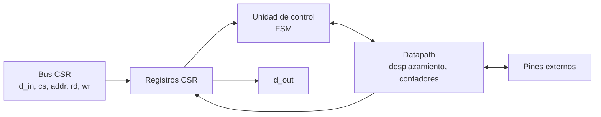
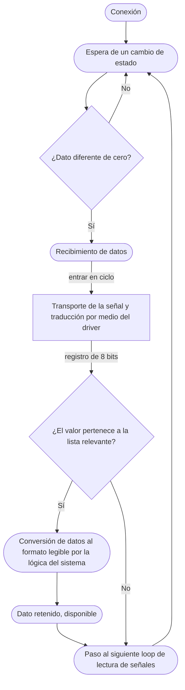

# Diagramas — Teclado PS/2

## Diagrama de bloques

## Diagrama de flujo

> El diagrama de flujo corresponde a la hoja **«E Keyboard»** de [`diagramas/Diagrama_de_Flujo.drawio`](../../../diagramas/Diagrama_de_Flujo.drawio).

## Máquina de estados

`IDLE`, `DATA` (contador 0–7), `PARITY`, `STOP`. Datapath: sincronizador de 2 flip-flops, filtro del reloj PS/2, registro de desplazamiento, FIFO de 8–16 posiciones.

El diagrama ASM detallado se agrega aquí en el checkpoint 2.
