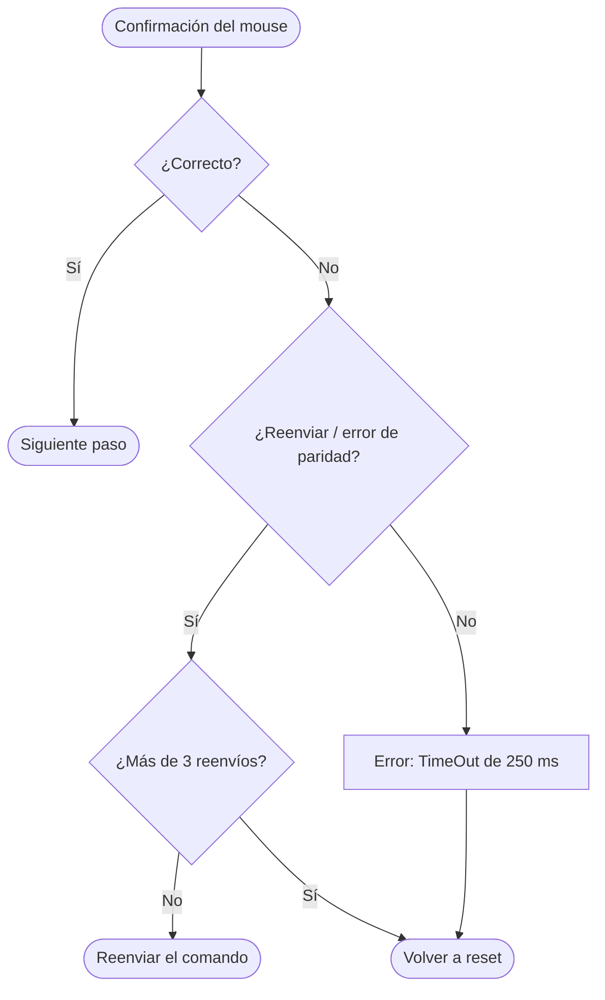

# Mouse PS/2

> **Estado: especificación preliminar (checkpoint 1).** Los registros y diagramas pueden cambiar en el checkpoint 2 (ASM). Todo cambio que afecte a otros equipos se acuerda por *issue* en el repositorio general.

| | |
|---|---|
| **Equipo responsable** | Grupo F — Mouse PS/2 (ver [`planificacion/equipos.md`](../../planificacion/equipos.md)) |
| **Región de memoria** | `0x440000 – 0x44FFFF` |
| **Archivo RTL** | `cores/ps2_mouse/rtl/perip_ps2mouse.v` |

## Función

Leer el movimiento y los botones de un mouse PS/2 (por ejemplo, para mover un cursor o apuntar en el juego).

## Protocolo

PS/2 bidireccional. Antes de leer, el host configura el mouse: reset y autotest, secuencia de frecuencias de muestreo, solicitud de ID, resolución, escala, frecuencia de muestreo y habilitación (`0xF4`). Cada comando espera la confirmación del mouse (`0xFA`); si llega mal se reenvía. Luego el mouse envía paquetes de 3 bytes: botones y signos, ΔX, ΔY.

**Pines externos:** `ps2m_clk`, `ps2m_data` (colector abierto; el host debe poder forzarlos a 0).

## Interfaz con el bus (igual para todos los periféricos)

```verilog
module perip_ps2mouse (
    input  wire        clk,
    input  wire        rst,
    input  wire [31:0] d_in,    // dato que escribe la CPU
    input  wire        cs,      // selección desde el decodificador de direcciones
    input  wire [4:0]  addr,    // desplazamiento local (ancho según el número de registros)
    input  wire        rd,
    input  wire        wr,
    output reg  [31:0] d_out    // dato que lee la CPU
    // + pines externos del protocolo
);
```

## Registros CSR (preliminar)

Direcciones relativas a la base de la región. Todos los registros son de 32 bits.

| Desplazamiento | Nombre | Acceso | Descripción |
|---|---|---|---|
| `0x00` | `DX` | R | Desplazamiento X del último paquete (con signo, 9 bits). |
| `0x04` | `DY` | R | Desplazamiento Y del último paquete (con signo, 9 bits). |
| `0x08` | `BUTTONS` | R | Bit 0 izquierdo, bit 1 derecho, bit 2 central. |
| `0x0C` | `STATUS` | R | Bit 0 `NEW_PACKET` (se limpia al leer DX). Bit 1 `ERR`. Bit 2 `READY` (inicialización terminada). |
| `0x10` | `CONTROL` | R/W | Bit 0 `INIT`: envía 0xF4 al mouse. |

## Diseño

- Diagramas de bloques y de flujo: [`diagramas/`](diagramas/README.md)
- Estados previstos: Transmisión host→dispositivo: `INHIBIT`, `REQ`, `SEND`, `WAIT_ACK`. Recepción: se reutiliza el receptor PS/2 del teclado + contador de bytes del paquete (0–2).

## Confirmación de cada comando

Después de cada paso de la configuración (marcados con «C» en la hoja del grupo) se verifica la respuesta del mouse:



## Traducción al comando común

El movimiento se traduce a `UP` / `DOWN` / `LEFT` / `RIGHT` y los botones a `A`, `B`, `Start` y `Select`, igual que el teclado y el control NES.

## Plan de verificación (checkpoint 3)

Cada prueba del testbench imprime `PASS` o `FAIL` y declara estímulo, resultado esperado y criterio de aprobación.

1. El testbench modela el mouse: responde `0xFA` a cada comando de la configuración y envía un paquete (ΔX=+5, ΔY=−3, botón izquierdo).
2. Verificar la trama que el host envía (inhibición del reloj y bits de 0xF4).
3. Caso de error: el mouse no confirma → reenvío; tras 3 reenvíos o 250 ms sin respuesta → `ERR=1` y vuelta a reset.

## Firmware previsto

Funciones del driver en `firmware/`: `mouse_init()`, `mouse_poll(&dx, &dy, &buttons)`.

## Avance

| Checkpoint | Entregable | Estado |
|---|---|---|
| 1 | Flowchart + registros CSR | 🟡 en desarrollo (este documento) |
| 2 | ASM del datapath y del control | ⚪ pendiente |
| 3 | RTL + testbench (`make sim`) | ⚪ pendiente |
| 4 | Integración en la FPGA | ⚪ pendiente |
| 5 | Demo final | ⚪ pendiente |
