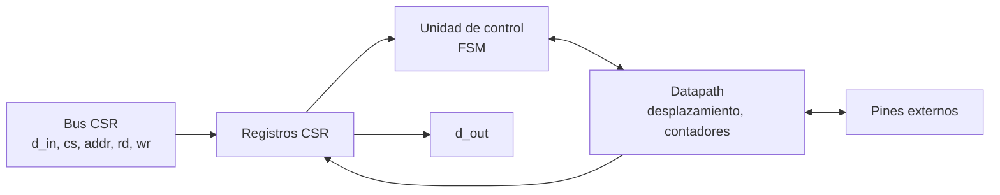
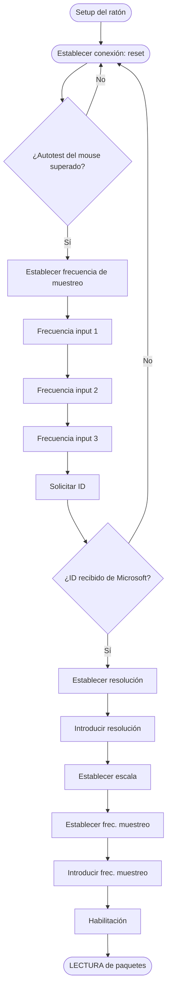

# Diagramas — Mouse PS/2

## Diagrama de bloques

## Diagrama de flujo

> El diagrama de flujo corresponde a la hoja **«F-Mouse»** de [`diagramas/Diagrama_de_Flujo.drawio`](../../../diagramas/Diagrama_de_Flujo.drawio).

## Máquina de estados

Transmisión host→dispositivo: `INHIBIT`, `REQ`, `SEND`, `WAIT_ACK`. Recepción: se reutiliza el receptor PS/2 del teclado + contador de bytes del paquete (0–2).

El diagrama ASM detallado se agrega aquí en el checkpoint 2.
