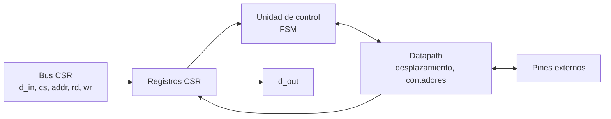
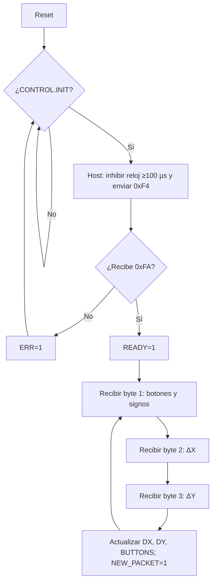

# Diagramas — Mouse PS/2

## Diagrama de bloques

## Diagrama de flujo (preliminar)

## Máquina de estados

Transmisión host→dispositivo: `INHIBIT`, `REQ`, `SEND`, `WAIT_ACK`. Recepción: se reutiliza el receptor PS/2 del teclado + contador de bytes del paquete (0–2).

El diagrama ASM detallado se agrega aquí en el checkpoint 2.
