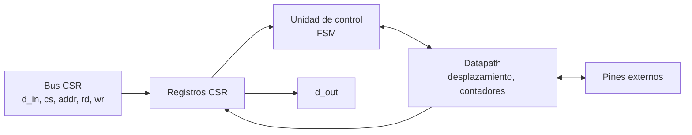
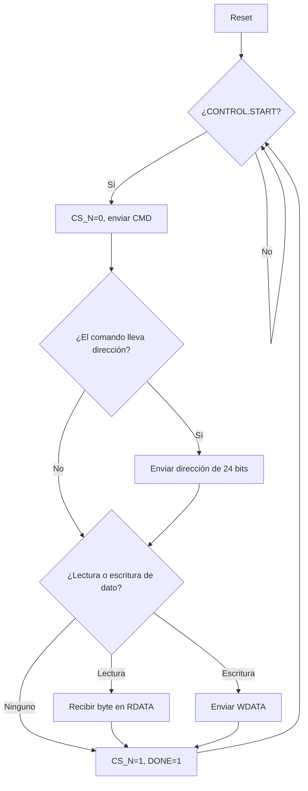

# Diagramas — SPI-Flash

## Diagrama de bloques

## Diagrama de flujo (preliminar)

## Máquina de estados

`IDLE`, `CMD`, `ADDR`, `DATA`, `DONE`. Puede reutilizar el maestro SPI del Grupo 2 (misma base de RTL que la SPI-RAM).

El diagrama ASM detallado se agrega aquí en el checkpoint 2.
