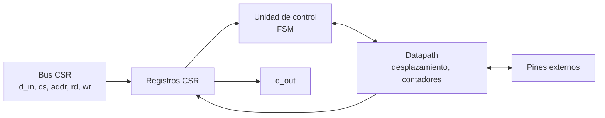
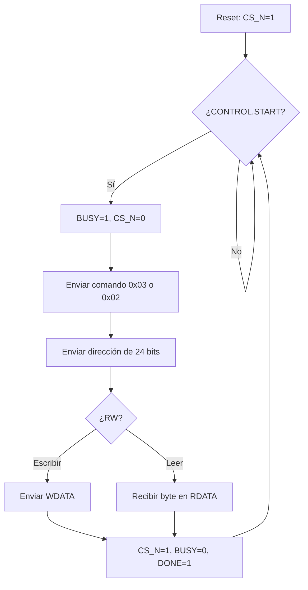

# Diagramas — SPI-RAM

## Diagrama de bloques

## Diagrama de flujo (preliminar)

## Máquina de estados

`IDLE`, `CMD`, `ADDR`, `DATA`, `DONE`. Datapath: registro de desplazamiento de 8 bits + contador de bits + divisor de reloj.

El diagrama ASM detallado se agrega aquí en el checkpoint 2.
