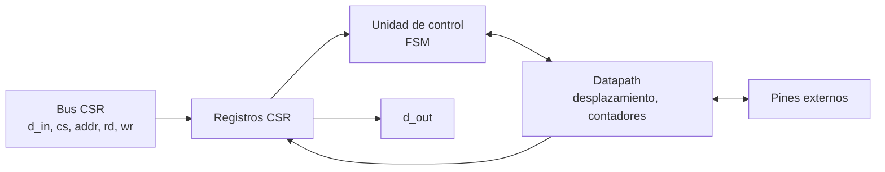
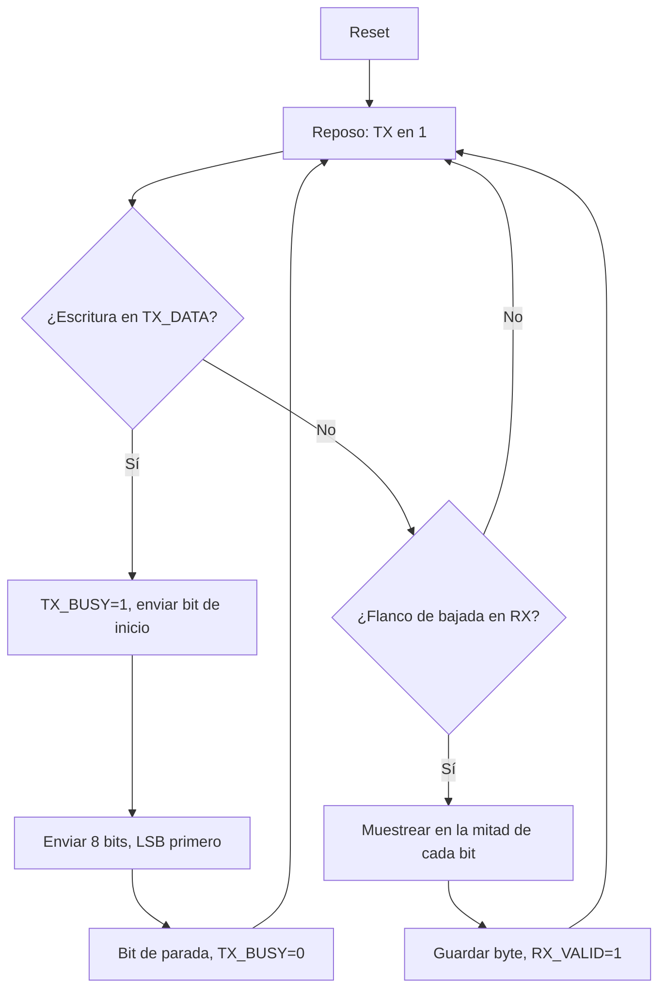

# Diagramas — UART (depuración)

## Diagrama de bloques

## Diagrama de flujo (preliminar)

## Máquina de estados

`IDLE`, `START`, `DATA` (contador de 8 bits), `STOP` — una máquina para TX y otra para RX.

El diagrama ASM detallado se agrega aquí en el checkpoint 2.
