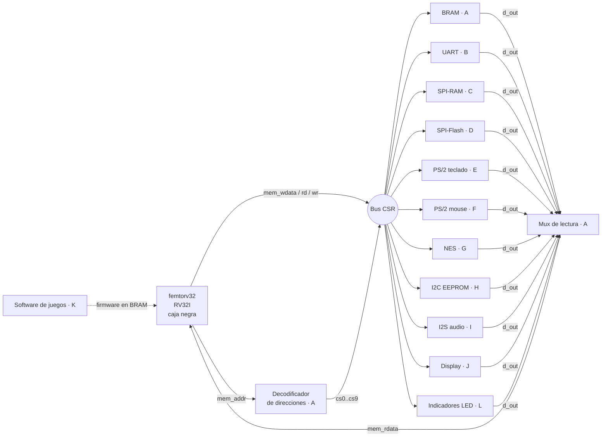
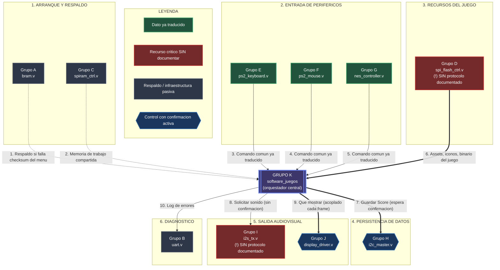

# Diagramas del sistema

Diagramas generales de la consola. Los diagramas internos de cada periférico están en `cores/<periferico>/diagramas/`.

El archivo fuente de todos los diagramas de flujo es [`Diagrama_de_Flujo.drawio`](Diagrama_de_Flujo.drawio). Se abre en [app.diagrams.net](https://app.diagrams.net) (*Archivo → Abrir desde → Dispositivo*) o con la extensión Draw.io de VS Code. Las versiones en Mermaid de esta página y de cada periférico se generaron a partir de ese archivo; si se cambia el `.drawio`, se debe actualizar también el Mermaid correspondiente.

| Hoja del `.drawio` | Contenido | Dónde está en el repositorio |
|---|---|---|
| Diagrama V2 | Flujo general del sistema (4 fases) | [§3 de esta página](#3-diagrama-de-flujo-general) |
| Software-Juegos-Relaciones | Relación del Grupo K con los demás módulos | [§4 de esta página](#4-relación-entre-módulos) |
| Diagrama General + Diagrama de Juego, Página-17 | Flujo del juego (vidas, colisiones, puntaje) | [`firmware/README.md`](../firmware/README.md) |
| Software_juegos | Menú, submenú y opciones | [`firmware/README.md`](../firmware/README.md) |
| E Keyboard | Teclado PS/2 | [`cores/ps2_keyboard`](../cores/ps2_keyboard/diagramas/README.md) |
| F-Mouse | Mouse PS/2 | [`cores/ps2_mouse`](../cores/ps2_mouse/diagramas/README.md) |
| Controlador NES | Control NES | [`cores/nes_ctrl`](../cores/nes_ctrl/diagramas/README.md) |
| H.1 Protocolo I^2C | I2C | [`cores/i2c`](../cores/i2c/diagramas/README.md) |
| I2S | Audio I2S | [`cores/i2s`](../cores/i2s/diagramas/README.md) |
| Matriz led | Indicador de error (MAX7219) | [`cores/indicadores`](../cores/indicadores/diagramas/README.md) |
| Flash, Protocolo SPI-RAM | Vacías por ahora | — |
| Grupo 9 a 11 | Borrador del flujo general | — |

## 1. Diagrama de bloques del SoC

Imagen oficial del curso: [`../diagrama_soc_digital1_v3.svg`](../diagrama_soc_digital1_v3.svg). Versión con los grupos:

## 2. Decodificador de direcciones (Grupo A)

Cada periférico ocupa una ventana de 64 KB. El decodificador mira los bits altos de `mem_addr`:

| Condición | Señal | Periférico |
|---|---|---|
| `mem_addr < 0x400000` | `cs0` | BRAM |
| `mem_addr[23:16] == 8'h40` | `cs1` | UART |
| `mem_addr[23:16] == 8'h41` | `cs2` | SPI-RAM |
| `mem_addr[23:16] == 8'h42` | `cs3` | SPI-Flash |
| `mem_addr[23:16] == 8'h43` | `cs4` | Teclado PS/2 |
| `mem_addr[23:16] == 8'h44` | `cs5` | Mouse PS/2 |
| `mem_addr[23:16] == 8'h45` | `cs6` | Control NES |
| `mem_addr[23:16] == 8'h46` | `cs7` | I2C |
| `mem_addr[23:16] == 8'h47` | `cs8` | I2S |
| `mem_addr[23:19] == 5'b01001` (`0x48`–`0x4F`) | `cs9` | Display |
| por asignar (propuesta `0x51`) | `cs10` | Indicadores LED (Grupo L) |

El decodificador también resta la dirección base: cada periférico recibe en `addr` solo el desplazamiento local.

## 3. Diagrama de flujo general

Hoja **«Diagrama V2»** del `.drawio`. Cada paso indica qué grupo lo implementa.

```mermaid
flowchart TD
    subgraph Fase_Inicio [FASE 1: ARRANQUE Y DIAGNÓSTICO]
        Power([Encendido]) --> Boot["Cargar Bootloader de BRAM (Grupo A: bram.v, memoria de arranque)"]
        Boot --> InitHW["Inicializar UART y Bus CSR (Grupo B: uart.v, diagnóstico; Grupo A: bram.v, bus)"]
        InitHW --> SelfTest["Autotest liviano de SPI-RAM y SPI-Flash (Grupo C: spiram_ctrl.v; Grupo D: spi_flash_ctrl.v)"]
        
        SelfTest --> HWok{{"¿SPI-RAM y SPI-Flash responden? (Grupos C y D: memoria de trabajo y almacenamiento)"}}
        HWok -- No --> HardFail["FALLO CRÍTICO: mostrar error en Display y registrar por UART (Grupo J: display_driver.v; Grupo B: uart.v)"]
        HWok -- Si --> LoadMenuAssets["Cargar assets del menú desde Flash (Grupo D: spi_flash_ctrl.v, lectura de recursos)"]
        
        LoadMenuAssets --> Checksum["Calcular checksum del menú cargado (Grupo K: software_juegos)"]
        Checksum --> ChkOk{{"¿Checksum coincide? (Grupo K: software_juegos, validación)"}}
        ChkOk -- No --> SoftFail["ADVERTENCIA: cargar menú mínimo desde BRAM y registrar por UART (Grupo A: bram.v; Grupo B: uart.v)"]
        ChkOk -- Si --> ScanPorts[/"Escanear 2 puertos y leer registros de control (Grupos E: ps2_keyboard.v; F: ps2_mouse.v; G: nes_controller.v)"/]
        SoftFail --> ScanPorts
        HardFail --> STOP([Sistema Detenido])
    end

    subgraph Fase_Perifericos [FASE 2: GESTIÓN DE PERIFÉRICOS]
        ScanPorts --> IsConnected{"¿Hay control conectado? (Grupos E: teclado; F: mouse; G: NES)"}
        
        IsConnected -- No --> LED_Off["Apagar LED RGB del puerto (Grupo L: pantallas RGB y LEDs de puerto)"]
        IsConnected -- Si --> ReadSignature[/"Leer estado e identificación según el periférico (Grupo E: ps2_keyboard.v; F: ps2_mouse.v; G: nes_controller.v)"/]
        
        ReadSignature --> IdentifyType{"¿Qué tipo de control se detectó? (Grupos E, F y G)"}
        IdentifyType -- "NES, teclado o mouse" --> LED_On["Encender LED RGB del puerto según el tipo (Grupo L) y actualizar registro (Grupo K usa el estado)"]
        IdentifyType -- "No reconocido" --> LED_Off
        
        LED_On & LED_Off --> CtrlRGB["Actualizar pantallas RGB laterales (Grupo L: periférico adicional; Grupo J: salida visual si aplica)"]
        CtrlRGB --> LoadIcons["Cargar íconos desde Flash (Grupo D: lectura; Grupo K: recursos; Grupo J: formato y dibujo)"]
    end

    subgraph Fase_Menu [FASE 3: NAVEGACIÓN Y SELECCIÓN LOCAL]
        LoadIcons --> ShowMenu["Mostrar paneles de juegos Single / Multi-Local (Grupo J: display_driver.v; Grupo K: software_juegos)"]
        ShowMenu --> ResetTimer["Reiniciar temporizador de inactividad (Grupo K: software_juegos)"]
        
        ResetTimer --> Idle{"¿Entrada de control? (Grupo K: software_juegos)"}
        Idle -- No --> Tick["Aumentar temporizador de inactividad (Grupo K: software_juegos)"]
        Tick --> TimerCheck{"¿Inactividad supera el límite? (Grupo K: software_juegos)"}
        TimerCheck -- Si --> DemoMode["Modo Demo o animación (Grupo K: lógica; Grupo J: visualización)"]
        TimerCheck -- No --> Idle
        
        DemoMode -- "Cualquier entrada" --> ExitDemo["Detener animación y redibujar menú (Grupo K: software_juegos; Grupo J: display_driver.v)"]
        ExitDemo --> ResetTimer
        
        Idle -- Si --> Translate[/"Traducir entrada a comando común A/B/Pad (Grupos E: teclado; F: mouse; G: NES; K: software_juegos)"/]
        Translate --> Nav{"¿Qué comando llegó? (Grupo K: software_juegos)"}
        Nav -- L / R --> SwitchPanel["Cambiar panel de juego (Grupo K: lógica; Grupo J: display_driver.v)"]
        Nav -- A --> Validate["Verificar requisitos del modo local (Grupo K: software_juegos)"]
        Nav -- B --> ShowMenu
        
        SwitchPanel --> ResetTimer
        
        Validate --> MultiCheck{"¿Hay suficientes controles para el modo? (Grupo K: software_juegos; datos de E, F y G)"}
        MultiCheck -- No --> ErrorPrompt["Mostrar aviso de controles faltantes (Grupo J: display_driver.v; mensaje definido por K)"]
        ErrorPrompt --> WaitB[/"Esperar botón B para regresar al menú (Grupo K: software_juegos)"/]
        WaitB --> ShowMenu
        
        MultiCheck -- Si --> LoadGame["Cargar juego a RAM (Grupo D: spi_flash_ctrl.v; Grupo C: spiram_ctrl.v)"]
        LoadGame --> RunGame["Ejecutar juego (Grupo K: software_juegos)"]
    end

    subgraph Fase_Ejecucion [FASE 4: EJECUCIÓN, AUDIO Y SEGURIDAD EN CALIENTE]
        RunGame --> SoundCheck{"¿El juego solicita un sonido? (Grupo K: software_juegos)"}
        SoundCheck -- Si --> PlaySound["Enviar sonido al módulo I2S (Grupo K: solicitud; Grupo I: i2s_tx.v; Grupo D: recurso en Flash si aplica)"]
        SoundCheck -- No --> Monitoring[/"Escuchar estado de controles (Grupos E: teclado; F: mouse; G: NES)"/]
        PlaySound --> Monitoring
        
        Monitoring --> HotPlug{{"¿Cambió el estado de un control activo? (Grupo K: software_juegos; información de E, F o G)"}}
        HotPlug -- Si --> PauseGame["Pausar juego y bloquear Reanudar (Grupo K: software_juegos; aviso en Grupo J: display_driver.v)"]
        HotPlug -- No --> RunGame
        
        PauseGame --> Reconnect{{"¿Reconectar control o salir? (Grupo K: software_juegos)"}}
        Reconnect -- Reconectado --> RunGame
        Reconnect -- Salir --> ShowMenu
    end
```

## 4. Relación entre módulos

Hoja **«Software-Juegos-Relaciones»**. El Grupo K (software de juegos) es el orquestador central: recibe el comando común ya traducido de las entradas y decide qué mostrar, qué sonar y qué guardar.

## 5. Partición hardware / software

| Función | Hardware (RTL) | Software (C) |
|---|---|---|
| Protocolos (tiempos, bits, relojes) | ✅ | |
| Buffers y FIFO de entrada/salida | ✅ | |
| Secuencias de alto nivel (leer EEPROM, programar Flash, configurar el mouse) | | ✅ |
| Traducir teclas y botones al comando común A/B/Start/Select/Pad | | ✅ |
| Menú, modo demo, hot-plug y lógica del juego | | ✅ (Grupo K) |

Criterio: lo que depende de tiempos del orden de µs o menos va en hardware. Lo que es una secuencia de pasos o una decisión va en C.
