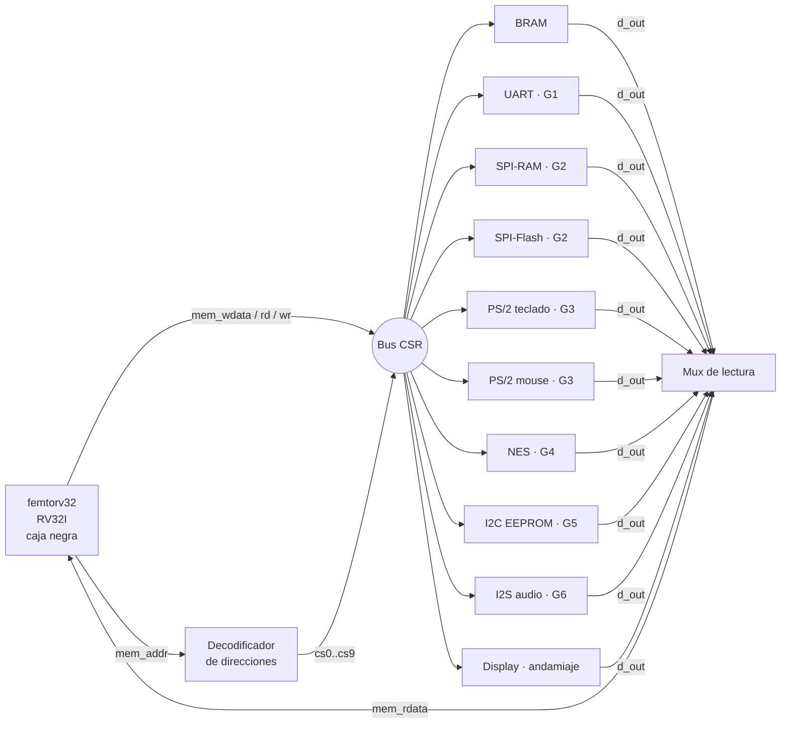
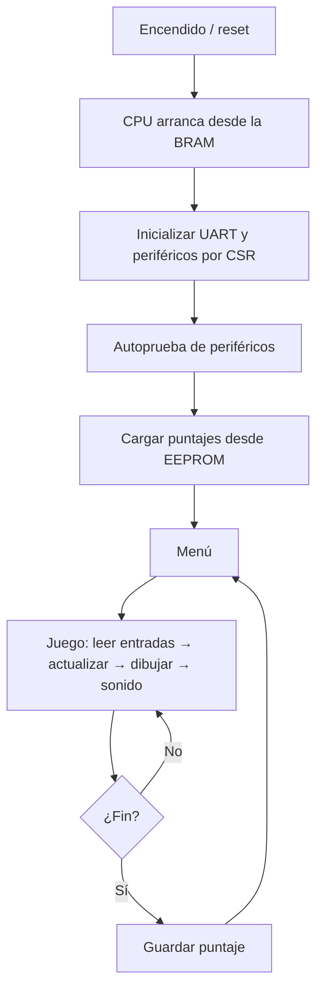

# Diagramas del sistema

Diagramas generales de la consola. Los diagramas internos de cada periférico están en `cores/<periferico>/diagramas/`.

## 1. Diagrama de bloques del SoC

Imagen oficial del curso: [`../diagrama_soc_digital1_v3.svg`](../diagrama_soc_digital1_v3.svg). Versión simplificada:

## 2. Decodificador de direcciones (G1)

Cada periférico ocupa una ventana de 64 KB. El decodificador mira los bits altos de `mem_addr`:

| Condición | Señal | Periférico |
|---|---|---|
| `mem_addr < 0x400000` | `cs0` | BRAM |
| `mem_addr[23:16] == 8'h40` | `cs1` | UART |
| `mem_addr[23:16] == 8'h41` | `cs2` | SPI-RAM |
| `mem_addr[23:16] == 8'h42` | `cs3` | SPI-Flash |
| `mem_addr[23:16] == 8'h43` | `cs4` | Teclado PS/2 |
| `mem_addr[23:16] == 8'h44` | `cs5` | Mouse PS/2 |
| `mem_addr[23:16] == 8'h45` | `cs6` | Control NES |
| `mem_addr[23:16] == 8'h46` | `cs7` | I2C |
| `mem_addr[23:16] == 8'h47` | `cs8` | I2S |
| `mem_addr[23:19] == 5'b01001` (`0x48`–`0x4F`) | `cs9` | Display |

El decodificador también resta la dirección base: cada periférico recibe en `addr` solo el desplazamiento local.

## 3. Flujo general del sistema

El detalle del firmware está en [`../firmware/README.md`](../firmware/README.md).

## 4. Partición hardware / software

| Función | Hardware (RTL) | Software (C) |
|---|---|---|
| Protocolos (tiempos, bits, relojes) | ✅ | |
| Buffers y FIFO de entrada/salida | ✅ | |
| Secuencias de alto nivel (leer EEPROM, programar Flash) | | ✅ |
| Traducir scan codes y botones a acciones del juego | | ✅ |
| Lógica del juego | | ✅ (sobre el núcleo suministrado) |

Criterio: lo que depende de tiempos del orden de µs o menos va en hardware. Lo que es una secuencia de pasos o una decisión va en C.
