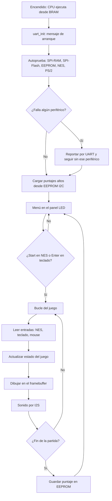

# Firmware de integración

Aquí van el **juego** y los programas en C que usan varios periféricos a la vez. El driver de cada periférico **no** va aquí, sino en `cores/<periferico>/firmware/`.

| Carpeta | Contenido | Responsable |
|---|---|---|
| `blink_test/` | Ejemplo del profesor: usa el driver de `blink` | referencia |
| `selftest/` *(pendiente)* | Autoprueba de arranque: prueba cada periférico e informa por UART | G1-C |
| `juego/` *(pendiente)* | Juego sobre el núcleo suministrado (andamiaje), con entradas PS/2/NES, puntajes I2C y sonido I2S | todos, coordina G1 |

## Flujo previsto del firmware

La forma de compilar a `firmware.hex` (cargado en la BRAM con `$readmemh`) la documenta G1 en la tarea `T-G1-04`.
