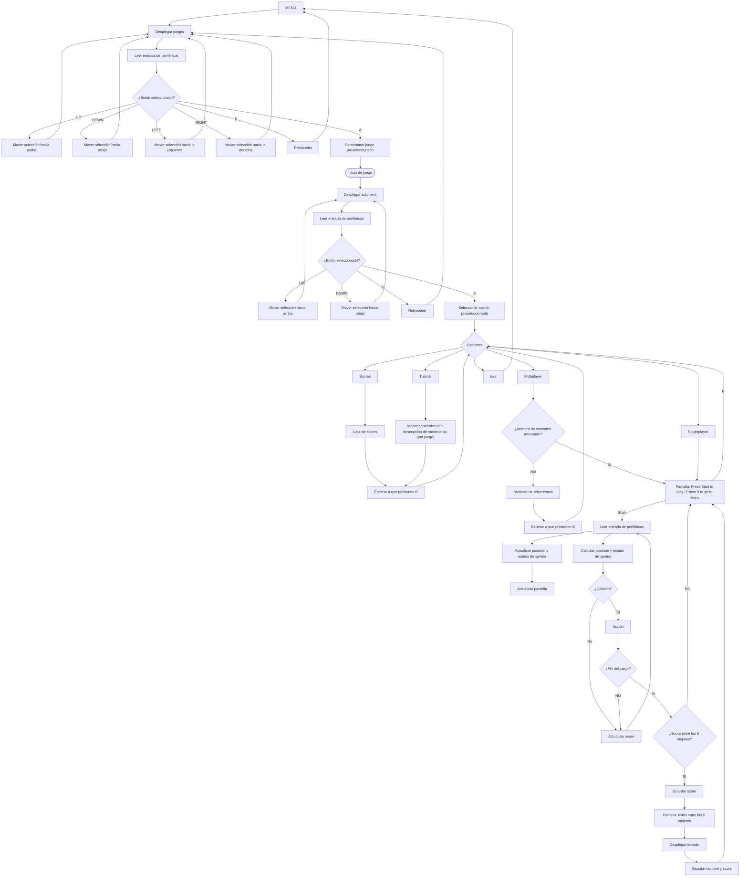
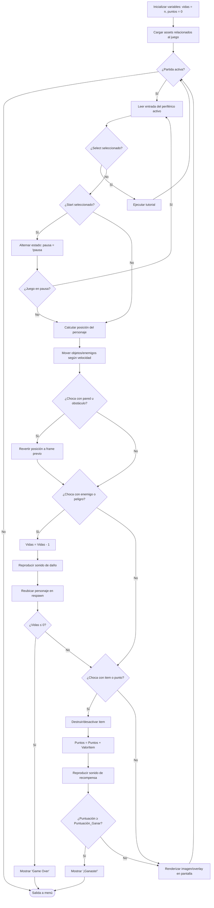

# Software de juegos (Grupo K)

Aquí van el **juego** y los programas en C que usan varios periféricos a la vez. El driver de cada periférico **no** va aquí, sino en `cores/<periferico>/firmware/`.

El Grupo K es el **orquestador central** (ver [relación entre módulos](../diagramas/README.md#4-relación-entre-módulos)): recibe de los Grupos E, F y G el comando común ya traducido (A/B/Start/Select/Pad), lee assets de la Flash (D), usa la SPI-RAM como memoria de trabajo (C), pide sonidos al I2S (I), guarda puntajes por I2C (H), le dice al display qué mostrar (J) y registra errores por UART (B).

| Carpeta | Contenido |
|---|---|
| `blink_test/` | Ejemplo del profesor: usa el driver de `blink` |
| `selftest/` *(pendiente)* | Fase 1: autotest de SPI-RAM y SPI-Flash, checksum del menú, log por UART |
| `menu/` *(pendiente)* | Fases 2 y 3: puertos, menú, submenú, modo demo |
| `juego/` *(pendiente)* | Fase 4: bucle del juego, sonido, hot-plug y puntajes |

El flujo general de las cuatro fases está en [`diagramas/README.md`](../diagramas/README.md#3-diagrama-de-flujo-general). Los diagramas de esta página vienen de [`Diagrama_de_Flujo.drawio`](../diagramas/Diagrama_de_Flujo.drawio).

## 1. Menú y opciones

Hoja **«Software_juegos»**.

## 2. Lógica del juego (un frame)

Hojas **«Diagrama General + Diagrama de Juego»** y **«Página-17»**.

## Compilación

La forma de compilar a `firmware.hex` (cargado en la BRAM con `$readmemh`) la documenta el Grupo A junto con el Grupo K (tarea `T-K-02` del [cronograma](../planificacion/cronograma.md)).
