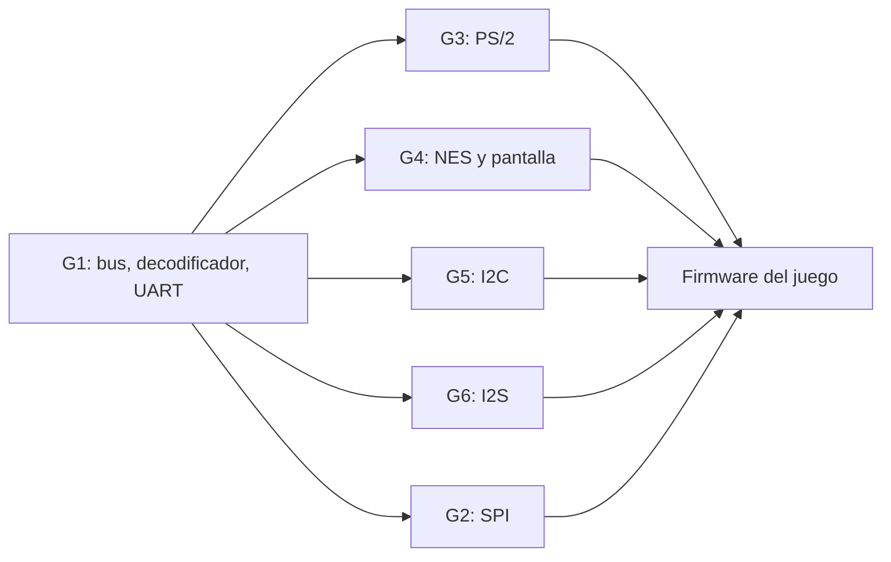

# Equipos y responsabilidades

> **Pendiente:** reemplazar `Integrante A/B/C` y `@usuario` por los nombres y usuarios de GitHub reales. Los códigos (`G1-A`, `G2-B`…) son los que usa el [cronograma](cronograma.md).

Reglas:

- Cada grupo es dueño de sus periféricos **completos**: especificación, ASM, RTL, testbench, driver en C y prueba en la FPGA.
- Cada integrante tiene tareas propias. La responsabilidad del grupo no reemplaza la individual.
- Todos los integrantes escriben código RTL o C y participan en la verificación.

---

## G1 — Integración del SoC, UART y firmware de integración

El grupo del bus: sin su trabajo nadie puede probar en la FPGA.

| Código | Integrante | GitHub | Tareas |
|---|---|---|---|
| G1-A | Integrante A | @usuario | Decodificador de direcciones (`cs0`–`cs9`), mux de `d_out` y top `SOC.v`; revisión de los PR de integración |
| G1-B | Integrante B | @usuario | Periférico `uart` (RTL, testbench, driver `uart_putc/getc`) |
| G1-C | Integrante C | @usuario | Flujo de compilación del firmware (`firmware.hex` en BRAM), programa de autoprueba de arranque que llama a las pruebas de todos los periféricos e informa por UART |

## G2 — Memoria externa SPI

| Código | Integrante | GitHub | Tareas |
|---|---|---|---|
| G2-A | Integrante A | @usuario | Maestro SPI común + periférico `spiram` |
| G2-B | Integrante B | @usuario | Periférico `spi_flash` (reutiliza el maestro SPI) |
| G2-C | Integrante C | @usuario | Modelos SPI de RAM y Flash para los testbench; drivers C y prueba de memoria en arranque |

## G3 — Entradas PS/2

| Código | Integrante | GitHub | Tareas |
|---|---|---|---|
| G3-A | Integrante A | @usuario | Receptor PS/2 común + periférico `ps2_keyboard` con FIFO |
| G3-B | Integrante B | @usuario | Periférico `ps2_mouse` (envío host→dispositivo de `0xF4`, paquetes de 3 bytes) |
| G3-C | Integrante C | @usuario | Testbench con modelo de teclado y mouse; drivers C (`kbd_get_key`, `mouse_poll`) |

## G4 — Control NES y pantalla

| Código | Integrante | GitHub | Tareas |
|---|---|---|---|
| G4-A | Integrante A | @usuario | Periférico `nes_ctrl` (LATCH/CLK/DATA, dos jugadores) |
| G4-B | Integrante B | @usuario | Testbench con modelo del 4021; driver C `nes_read` |
| G4-C | Integrante C | @usuario | Integración del driver de panel / framebuffer suministrado; programa de prueba de pantalla |

## G5 — I2C y puntajes

| Código | Integrante | GitHub | Tareas |
|---|---|---|---|
| G5-A | Integrante A | @usuario | Periférico `i2c` maestro (START, STOP, WRITE, READ, ACK) |
| G5-B | Integrante B | @usuario | Modelo de EEPROM 24LC256 para el testbench; verificación de casos de error (NACK) |
| G5-C | Integrante C | @usuario | Driver C (`eeprom_read/write`) y tabla de puntajes altos (`score_save/load`) |

## G6 — Audio I2S

| Código | Integrante | GitHub | Tareas |
|---|---|---|---|
| G6-A | Integrante A | @usuario | Periférico `i2s` (BCLK, LRCLK, serializador) |
| G6-B | Integrante B | @usuario | FIFO de muestras y generador de tono; testbench |
| G6-C | Integrante C | @usuario | Driver C y efectos de sonido del juego (`sound_beep`, `sound_effect`) |

---

## Dependencias entre grupos

- Todos pueden **simular** su periférico sin esperar a nadie: el testbench maneja el bus directamente.
- Para **probar en la FPGA** hace falta el decodificador y el top del G1 (tarea `T-G1-03`) y la UART (`T-G1-10`), que sirve para ver resultados.
- G2 comparte el maestro SPI entre sus dos periféricos, y G3 el receptor PS/2 entre teclado y mouse.
