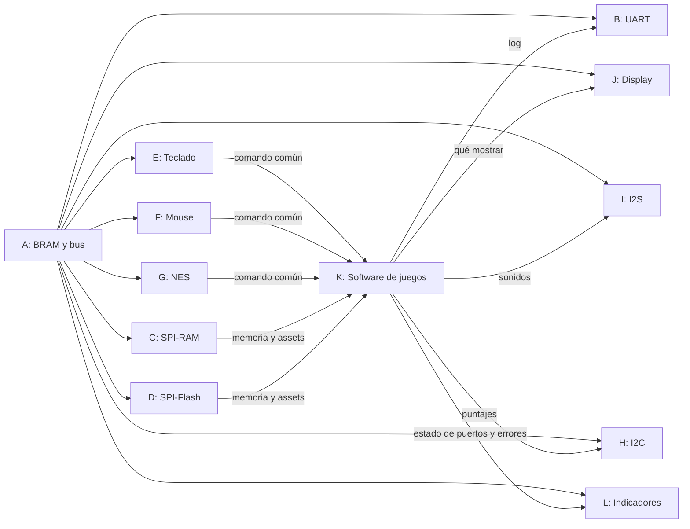

# Equipos y responsabilidades

La división sigue la del [diagrama de flujo general](../diagramas/README.md#3-diagrama-de-flujo-general): un grupo por módulo, identificado con una letra (A–L).

> **Pendiente:** completar la columna *Integrantes* con los nombres y usuarios de GitHub. Dentro de cada grupo, cada tarea del [cronograma](cronograma.md) se asigna a una persona en su *issue*.

| Grupo | Módulo | Carpeta | Integrantes |
|---|---|---|---|
| **A** | BRAM, bus y SoC: memoria de arranque, decodificador de direcciones, mux de lectura y top `SOC.v` | `soc` (pendiente) | |
| **B** | UART: diagnóstico y log de errores | [`cores/uart`](../cores/uart/README.md) | |
| **C** | SPI-RAM: memoria de trabajo, carga del juego | [`cores/spiram`](../cores/spiram/README.md) | |
| **D** | SPI-Flash: assets, íconos y binarios de los juegos | [`cores/spi_flash`](../cores/spi_flash/README.md) | |
| **E** | Teclado PS/2 | [`cores/ps2_keyboard`](../cores/ps2_keyboard/README.md) | |
| **F** | Mouse PS/2 | [`cores/ps2_mouse`](../cores/ps2_mouse/README.md) | |
| **G** | Control NES | [`cores/nes_ctrl`](../cores/nes_ctrl/README.md) | |
| **H** | I2C: EEPROM de puntajes y comprobación de elementos al encender | [`cores/i2c`](../cores/i2c/README.md) | |
| **I** | I2S: audio | [`cores/i2s`](../cores/i2s/README.md) | |
| **J** | Display: panel LED y framebuffer | [`cores/display`](../cores/display/README.md) | |
| **K** | Software de juegos: menú, modo demo, hot-plug, juegos y puntajes | [`firmware`](../firmware/README.md) | |
| **L** | Pantallas RGB laterales e indicadores LED de puerto | [`cores/indicadores`](../cores/indicadores/README.md) | |

## Qué entrega cada grupo

Cada grupo de periférico (B a J y L) es dueño de su módulo completo:

1. Especificación: función, protocolo, pines y registros CSR (`cores/
/README.md`).
2. Diagrama de flujo y ASM (`cores/
/diagramas/`).
3. RTL y testbench con `make sim` (`cores/
/rtl/`).
4. Driver en C y programa de prueba (`cores/
/firmware/`).
5. Prueba en la FPGA dentro del SoC compartido.

El Grupo A entrega el bus y el SoC que permiten probar todo en la FPGA. El Grupo K entrega el software que une todos los módulos.

## Dependencias entre grupos

- Todos pueden **simular** su periférico sin esperar a nadie: el testbench maneja el bus directamente.
- Para **probar en la FPGA** hace falta el bus y el top del Grupo A (tarea `T-A-03`) y la UART del Grupo B (`T-B-06`), que sirve para ver resultados.
- E, F y G deben acordar con K el formato del **comando común** (A/B/Start/Select/Pad).
- J y K deben acordar el formato de color y el tamaño del framebuffer.
